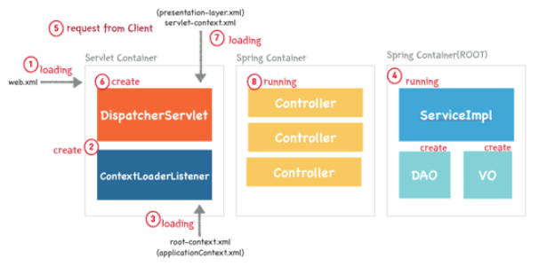

# Jani Project : Spring Tomcat WAS(Web Application Server)

`Jani Project Client GitHub`
https://github.com/NaJunYeop/Project_Jani_Spring_Boot_Websocket_Server

## Use.
---

- SpringBoot
- WebSocket Protocol
- STOMP Protocol over Websocket
- JPA
- MySQL
- HttpRequest
- Tomcat

  

> ## SpringBoot

### Why SpringBoot ?
---
 개발의 효율을 더하기 위해 `SpringBoot` 프레임워크를 사용했습니다. 애플리케이션을 신속하게 설정하고, 스프링 구동 애플리케이션을 빌드하기 위한 기본 구성을 제공하는 유틸리티이기에 개발의 효율을 더할 수 있었습니다. 또한, `MVC 패턴`을 적용하기에 효율적이었습니다.

`의존성 주입(DI, Dependency Injection)`과 `제어의 역전(IOC, Inversion Of Control)`은 스프링에서 가장 중요한 특징 중 하나입니다. 좀 더 **결합도를 낮추는 방식**으로 어플리케이션을 개발할 수 있습니다. 이러한 개발방식으로 개발한 응용프로그램은 단위테스트가 용이하기 때문에 보다 퀄리티 높은 프로그램을 개발할 수 있었습니다.
  
### SpringBoot vs Spring
---

`Spring 프레임워크`는 기능이 많은 만큼 환경설정이 복잡한 편입니다. `SpringBoot`는 Spring 프레임워크를 사용하기 위한 **설정의 많은 부분을 자동화**하여 사용자가 정말 편하게 Spring을 활용할 수 있도록 돕습니다. Spring boot starter 디펜던시만 추가해주면 바로 API를 정의하고, 내장된 톰캣이나 제티로 웹 애플리케이션 서버를 실행할 수 있습니다. 심지어 Spring 홈페이지의initializer를 사용하면 바로 실행 가능한 코드를 만들어줍니다. 실행환경이나 의존성 관리 등의 인프라 관련 등은 신경 쓸 필요없이 바로 코딩을 시작하면 됩니다. 그 것이 바로 key point입니다. 정리하면 다음과 같습니다.

1. 임베디드 톰캣(Embed Tomcat), 제티, 언더토우를 사용하여 **독립 실행이 가능한 Spring 어플리케이션 개발**
2. **통합 starter**를 제공하여 메이븐/그래들 구성 간소화
3. starter를 통한 **자동화된 Spring 설정** 제공
4. 번거로운 XML설정을 요구하지 않음
5. JAR을 사용하여 자바 옵션만으로도 배포 가능
6. 애플리케이션의 모니터링과 관리를 위한 **스프링 액츄에이터(Spring Actuator)** 제공
7. **간단한 어노테이션 설정**이나 **프로퍼티 설정**으로 세부적인 설정 없이 원하는 기능을 빠르게 적용할수 있습니다.

단점 ) 같은 서버 포트번호로 다르게 배포 시 (서로 다른 프로젝트) boot 버전을 맞춰야 합니다.

  
### SpringBoot Features
---
* Container 
Spring Framework에서는 `BeanFactory`와 이를 상속한 `ApplicationContext` 두 가지 유형의 컨테이너를 제공합니다.
 
`BeanFactory` 
**스프링 설정 파일(applicationContext.xml)**에 등록된 **bean 객체를 생성하고 관리하는 기능 제공을 제공**합니다. 컨테이너가 구동될 때 객체를 생성하는 것이 아니라, **클라이언트로의 요청에 의해서만 객체를 생성**합니다.
 
`ApplicationContext` 
**컨테이너가 구동되는 시점에 bean에 등록되어 있는 클래스를 객체화**합니다(Eager Loading). 트랜잭션 관리나 메시지 기반의 다국어 처리 등 다양한 기능을 지원합니다.

* IoC / DI (Inversion of Control / Dependency Injection)  
`“Inversion of Control” IoC`는 객체 생성을 자바 코드로 직접 처리하는 것이 아니라 **Container가 대신 처리**하게 합니다. 그와 동시에 객체와 객체 사이의 **의존관계 역시 Container가 처리**합니다.
  
`“Dependency Injection”`이란 뜻으로, 의존성 주입이란 말로 번역될 수 있습니다. 즉, 코드 상에서 사용자가 new 키워드로 객체를 생성하고 다른 객체와 관계를 설정하는 것이 아니라, **Spring Framework의 Container가 객체 간 의존관계**를 설정합니다.

* AOP (Aspect Oriented Programming) 
DI가 객체 간 의존성을 주입한 거라면, **AOP는 Logic 주입**이라고 할 수 있습니다.
AOP의 주 목적은 “**다수의 모듈에 공통적으로 나타나는 부분을 제거하는 것**”입니다. 반복적인 Logic을 공통 Logic으로 분리하면, 응집도를 높게 가져갈 수 있습니다. **AOP 또한 xml과 Annotation을 이용해서 설정**할 수 있습니다.

* PSA (Portable Service Abstraction) 
`JDBC`처럼 `Adapter 패턴`을 적용하여 같은 일을 하는 다수의 기술을 공통 인터페이스로 제어할 수 있게 한 것을 **서비스 추상화**라고 합니다. `Spring Framework`에서는 서비스 추상화를 위해 다양한 어댑터를 제공합니다. Spring Framework은 `OXM`, `ORM`, `Cache`, T`ransaction` 등 다양한 기술에 대한 `PSA`, 즉 **API 를 제공**합니다.
  

### SPRING FRAMEWORK 내부 동작 원리
---

